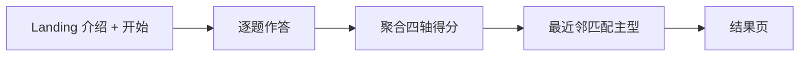

# TBTI（旅格测试）独立网页实现计划

## 背景与约束

- 仓库现状：仅有 [`docs/TBTI.md`](docs/TBTI.md)、PRD 等文档，**无现有前端代码**。
- 你已选择：**独立静态站点** + **首版自拟题目与计分**（后续可只改数据文件迭代）。
- [`docs/TBTI.md`](docs/TBTI.md) 明确了四维度与 18 型名称/副标/共鸣句，**未给出题目与「轴分数 → 18 型」的数学映射**；实现上采用可解释的 **4 维连续得分 + 与 18 个「类型指纹」最近邻**，便于日后微调 JSON 而不改代码逻辑。

## 技术选型

| 项 | 建议 |
|----|------|
| 脚手架 | `Vite` + `React` + `TypeScript` |
| 路由 | 单页即可（`useState` 控制步骤）；若未来扩展多页再用 `react-router` |
| 样式 | **CSS Modules** 或 **Tailwind**（二选一；若追求快迭代可用 Tailwind，否则 CSS Modules 依赖更少） |
| 部署产物 | `npm run build` → `dist/`；**托管目标定为 GitHub Pages**（见下文「GitHub Pages 部署方案」） |

建议目录：`/web/tbti/`（或 `apps/tbti/`，与日后 TravelPlan 主站并列清晰）。

## 信息架构与交互流程

- **Landing**：产品名「旅格测试 TBTI」、副标题「你在旅途里是哪种人？」、开始按钮、简短免责声明（与文档第 2 节一致）。
- **Quiz**：每次一题或移动端友好的卡片流；进度条；支持返回上一题（修正答案时重算即可）。
- **Result**：主型中文代号 + 可选英文副标；共鸣画面一句话；**四轴条形图**（行 / 钱 / 险 / 人，左右极标签取自文档表格）；复制「自嘲三连」模板或一键复制分享短文案（文档第 6 节话术结构）。

## 数据模型（核心）

### 四轴定义（与文档对齐）

每条题目选项附带对四个维度的 **增量**（同一套全局刻度，例如每轴累计后规范化到 `[-1, 1]` 或 `[0, 100]`）：

| 轴 | 负向（左极） | 正向（右极） |
|----|--------------|--------------|
| 行 | 攻略卷王 | 说走就走 |
| 钱 | 算账大师 | 体验至上 |
| 险 | 风险雷达 | 冒险体质 |
| 人 | 社交发动机 | 独狼模式 |

### 18 型「指纹」

在 `src/data/types.json`（或 `.ts`）中为每个类型定义 **目标向量** `(行, 钱, 险, 人)`（与题目同一刻度）。**匹配算法**：对用户归一化后的向量 $\mathbf{u}$，计算与每个类型向量 $\mathbf{t}_i$ 的欧氏距离（或余弦距离），取 $\arg\min_i \|\mathbf{u}-\mathbf{t}_i\|$ 作为主型。

- 首版指纹可按 [`docs/TBTI.md`](docs/TBTI.md) 表里「共鸣画面」语义人工填写近似坐标（例如「路书精」在行轴显著偏攻略卷王一侧）；后续运营只需改 JSON 即可调整分型边界。
- **可选增强（首版可简化）**：若最高分与第二名差距过小，结果页提示「边界型」或展示第二名昵称（减少用户吐槽「不准」）。

### 题库

- 体量：**约 16～24 题**，单选，每题 3～4 个选项。
- 出题原则：严格遵循文档第 5 节——**具体旅程行为**（延误、改签、预算、拍照、独行/组队等），避免抽象自我评价句。
- 存储：`src/data/questions.json`（或 TS 常量），字段示例：`id`, `text`, `options: [{ label, delta: { xing, qian, xian, ren } }]`（轴名可用拼音或英文 key 统一）。

## 模块划分（建议文件）

- [`web/tbti/src/lib/scoring.ts`](web/tbti/src/lib/scoring.ts)：汇总 delta → 归一化 → `nearestType(userVec, types)`。
- [`web/tbti/src/data/questions.json`](web/tbti/src/data/questions.json)、[`web/tbti/src/data/types.json`](web/tbti/src/data/types.json)：内容与指纹。
- [`web/tbti/src/App.tsx`](web/tbti/src/App.tsx)：步骤状态机（landing / quiz / result）。
- 组件：`Landing.tsx`、`QuizQuestion.tsx`、`AxisBars.tsx`、`ResultCard.tsx`、`Disclaimer.tsx`。

## 合规与传播

- 结果页与页脚固定展示文档中的 **非临床 / 趣味分型** 声明。
- 文案直接复用文档表格中的 **主代号、副标、共鸣画面**；话题标签可作为结果页次要展示或 meta description。

## 验证方式（交付前自检）

- `npm run build` 无报错；本地预览全流程可走通。
- 手工 spot-check：极端选项路径（全偏左 / 全偏右）应对应合理类型；随机抽几组中间答案检查是否出现明显荒谬映射（必要时微调 `types.json`）。

## 部署（代码写好之后）

本质是：**把 `npm run build` 生成的 `dist/` 里的静态文件**发布到 **GitHub Pages**，无需自有服务器。

### 通用本地检查

- 在 `web/tbti` 执行：`npm install` → `npm run build` → `npm run preview`，确认页面与静态资源路径正确后再推仓库。

### GitHub Pages 部署方案（已选）

**1）确认站点 URL 与 Vite `base`**

- **项目站（最常见）**：仓库 `https://github.com/<owner>/<repo>` 默认 Pages 地址为 `https://<owner>.github.io/<repo>/`，资源路径带 **`/<repo>/` 前缀**。  
  - 在 [`web/tbti/vite.config.ts`](web/tbti/vite.config.ts) 设置 **`base: '/<repo>/'`**（`<repo>` 与 GitHub 仓库名完全一致，区分大小写）。  
  - 实现阶段可用环境变量区分本地开发：`base: process.env.GITHUB_REPOSITORY ? '/' + process.env.GITHUB_REPOSITORY.split('/')[1] + '/' : '/'`，或在 CI 里注入 `VITE_BASE` / `BASE_URL`（以最终实现为准）。
- **用户/组织站**：仓库名为 `<owner>.github.io` 且内容在根目录发布时，站点在域名根路径，使用 **`base: '/'`**。

**2）仓库设置（一次性）**

- GitHub → 目标仓库 → **Settings → Pages**。  
- **Build and deployment → Source**：选 **GitHub Actions**（推荐，与下面 workflow 配套）。  
- 若使用自定义域名：**Pages → Custom domain** 填写域名，并按提示配置 DNS；此时仍要保证 Vite 的 `base` 与 GitHub 显示的站点路径一致（自定义域映射到同一站点后通常仍按「项目站或根站」二选一处理）。

**3）推荐：用 GitHub Actions 构建并发布 `dist`**

- 在仓库根目录新增 [`.github/workflows/deploy-pages.yml`](.github/workflows/deploy-pages.yml)（文件名可自定），逻辑要点：  
  - `on: push: branches: [main]`（或你实际默认分支）。  
  - `permissions`：`contents: read`，`pages: write`，`id-token: write`（`deploy-pages` 需要）。  
  - Job A：`actions/checkout`，`actions/setup-node`（指定与本地一致的 Node 版本），在 `web/tbti` 下执行 `npm ci`、`npm run build`。  
  - 使用 **`actions/upload-pages-artifact`**，`path: web/tbti/dist`。  
  - Job B：`needs` A，`environment: name: github-pages, url: ${{ steps.deployment.outputs.page_url }}`，`uses: actions/deploy-pages`。  
- 首次推送 workflow 后，在 **Actions** 页确认运行成功，再回到 **Settings → Pages** 查看分配的 URL。

**4）备选：手动发布（无 CI 时）**

- 本地 `npm run build` 后，将 `dist` 内容推到 `gh-pages` 分支根目录，或使用 `peaceiris/actions-gh-pages` 等 Action 只负责推送静态文件；仍需正确配置 **`base`**。

**5）发布节奏与注意点**

- 每次合并到默认分支即触发构建与覆盖发布；无服务端进程。  
- 生产环境可按需关闭或限制 source map 暴露。  
- 首版为单页状态机，一般 **无需** `404.html`；若后续接入 `react-router` 且使用 browserHistory，再考虑 Pages 的 SPA 回退策略。

### 其他托管方式（备选）

- **Vercel / Netlify / Cloudflare Pages**：构建命令 `npm run build`，输出目录 `web/tbti/dist`，`base: '/'` 通常即可。  
- **对象存储 + CDN / 自建 Nginx**：上传 `dist` 全文；多路由时再配回退到 `index.html`。

## 不在首版范围（可后续加）

- 后端持久化、账号、分享短链统计。
- 「副型」独立算法（文档提到可选）；首版可用「第二名类型」或四轴条代替。
- i18n 全量英文题库（可先只做 UI 级英文副标展示）。
