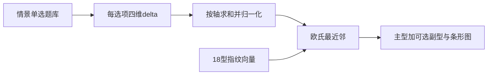

# TBTI 测试题与评分标准设计方案

## 依据与缺口

- **单一事实来源**：[`docs/TBTI.md`](docs/TBTI.md) 第 3 节（四轴左右极）、第 4 节（18 型代号 / 共鸣画面）、第 5 节（出题与结果呈现原则）。
- **文档未规定**：题目数量、选项赋分、以及「四轴向量 → 某一型」的解析式。**评分标准需自拟**，并与 [`docs/TBTI_plan.md`](docs/TBTI_plan.md) 中的数据模型（`delta` + `types.json` 指纹 + 最近邻）对齐，便于 [`web/tbti`](web/tbti) 直接落地。

## 测量模型（四轴刻度）

采用四维连续向量 `(行, 钱, 险, 人)`，与文档表格 **左极 → 右极** 一致：

| 轴 | 左极（较小数值一侧） | 右极（较大数值一侧） |
|----|----------------------|----------------------|
| 行 | 攻略卷王 | 说走就走 |
| 钱 | 算账大师 | 体验至上 |
| 险 | 风险雷达 | 冒险体质 |
| 人 | 社交发动机 | 独狼模式 |

**实现约定（与 TBTI_plan 一致）**：每题每个选项带 `delta: { xing, qian, xian, ren }`（小整数，如 ±1～±3），答题后**按轴求和**得到原始分 `(S_xing, S_qian, S_xian, S_ren)`，再**按轴归一化**到 `[-1, 1]`（例如：`clamp(raw / maxPossibleAxis, -1, 1)` 或对每轴用 `tanh`；首版推荐 **线性除以该轴本题库可达最大绝对值**，可解释、易调参）。

## 题型设计规范（可直接写进题库说明）

- **体量**：**16～24 题**，单选，每题 **3～4 个选项**（[`docs/TBTI_plan.md`](docs/TBTI_plan.md) 已约定）。
- **题干**：只写**可观察行为**（延误、改签、预算、拍照、独行/组队、夜间活动等），避免「我觉得自己很随性」类抽象自评（呼应 TBTI.md §5）。
- **选项**：每个选项对应一组 **delta**，允许一题同时牵动 **1～2 个轴为主**（其余为 0 或小权重），避免「一选项拉满四维」导致解释困难。
- **平衡**：粗略保证四轴都有足够题目牵引（例如每轴至少有 **4～6 次**有效载荷），并混入 **2～4 道「中性/双情境」题** 用于拉开中间人群，减少所有人挤在同一分型。
- **版权与话术**：题型叙事自主撰写；结果文案引用 TBTI.md 表中代号与共鸣句。

### 题目维度分配建议（蓝图）

可按场景模块命题，便于覆盖四轴又不重复：

| 模块示例 | 主要荷载轴 |
|----------|------------|
| 行前：做攻略 / 订机票酒店 / 请假节奏 | 行、钱 |
| 变故：延误、取消、丢东西、天气突变 | 险、行 |
| 花钱：溢价体验、优惠券、「来都来了」 | 钱 |
| 人际：群聊、拼车、独处、和陌生人搭话 | 人 |
| 节奏：打卡密度、暴走、睡到自然醒 | 行、险 |

### 示例题干（3 道，示意 delta 写法）

以下数值仅为示意，全库定稿时需按「该轴 maxPossible」统一标定。

1. **出发前一周，你的真实状态更接近？**  
   - A 表格拉到第 5 版，交通衔接写到分钟 → `delta: { xing: -2, qian: 0, xian: 0, ren: 0 }`  
   - B 只锁机票酒店，其它路上再说 → `{ xing: +2, ... }`  
   - C 每天改一版，取决于队友谁喊得大声 → `{ ren: -1, xing: +1, ... }`  

2. **航班突然延误 4 小时，你更可能？**  
   - A 立刻查备选航线/高铁，脑内已跑 Plan B/C → `{ xian: -2, xing: -1, ... }`  
   - B 打开游戏/视频，「到了再说」→ `{ xian: +1, xing: +2, ... }`  
   - C 群里直播吐槽，顺便约同行的人一起逛机场 → `{ ren: -2, ... }`  

3. **当地网红店排队 90 分钟，味道「听说很好」——你？**  
   - A 查差评关键词和平替，宁可走 10 分钟去另一家 → `{ qian: -2, ... }`  
   - B 来都来了，排！→ `{ qian: +2, qian: +1? }` 仅示意  
   - C 掉头找路边摊，排斥「必打卡」三个字 → `{ qian: -1, xing: +1, ... }`（贴近「网红过敏」气质，但仍通过轴得分体现）

全库可按同样模式扩展到 20 题左右，并在 spreadsheet 里校验 **每轴 delta 绝对值之和** 不过度失衡。

## 十八型评分标准（指纹 + 匹配规则）

TBTI.md **未给出** 每型的四轴坐标，需建立 **内容语义 → 指纹向量** 的规则（[`docs/TBTI_plan.md`](docs/TBTI_plan.md) 建议「按共鸣画面人工填写近似坐标」）。

### 匹配算法（标准写法）

1. 用户向量 `\mathbf{u} = (u_{行}, u_{钱}, u_{险}, u_{人})`（已归一化）。  
2. 每型存 `\mathbf{t}_i`。  
3. **主型** `i^* = \arg\min_i \|\mathbf{u} - \mathbf{t}_i\|_2`（欧氏距离）；也可用余弦相似度若更希望「形状」而非幅度——首版推荐 **欧氏**，调参直观。  
4. **可选规则（减少争议）**：若最近邻与次近邻距离差 `< ε`（如 `< 0.08`），结果页标注「边界型」或展示 **第二名**（TBTI_plan 已提及）。

### 十八型指纹草案表（[-1,1] 量级，供评审后写入 `types.json`）

解读：`-1` 贴近表左极，`+1` 贴近右极；**非数学推导**，由「共鸣画面」归纳，**上线前建议小规模试测校准**。

| # | 代号 | 行 | 钱 | 险 | 人 | 简要依据 |
|---|------|----|----|----|----|----------|
| 1 | 路书精 | -0.95 | 0 | -0.2 | -0.2 | 行程细到分钟 |
| 2 | 队长瘾 | -0.4 | 0 | 0 | -0.7 | 带队拍板、人际动员 |
| 3 | 先冲为敬 | +0.85 | +0.3 | +0.75 | 0 | 先买票再想假 |
| 4 | 氛围脑袋 | +0.2 | +0.5 | -0.2 | -0.5 | 感情/体验优先 |
| 5 | 全队妈咪 | -0.2 | +0.2 | -0.1 | -0.85 | 照顾全队 |
| 6 | 行走ATM | 0 | +0.9 | 0 | -0.2 | 「我来」付钱 |
| 7 | 比价CPU | 0 | -0.95 | 0 | 0 | 算账、差评关键词 |
| 8 | 坏事编剧 | -0.2 | 0 | -0.95 | +0.2 | 脑内灾难片 |
| 9 | 都行挂件 | +0.15 | 0 | +0.1 | 0 | 减震、随和 |
| 10 | 瞎溜达王 | +0.85 | +0.1 | +0.35 | 0 | 无计划乱逛 |
| 11 | 九宫格命 | -0.3 | +0.35 | 0 | -0.35 | 出片、社交展示 |
| 12 | 天黑开机 | +0.2 | +0.4 | +0.25 | -0.85 | 夜间社交满格 |
| 13 | 一人成团 | +0.2 | 0 | 0 | +0.9 | 独行降噪 |
| 14 | 情绪飞行模式 | 0 | 0 | -0.2 | +0.75 | 省电、少互动 |
| 15 | 网红过敏 | +0.35 | -0.25 | 0 | +0.25 | 反感爆款 |
| 16 | 铁腿特种兵 | -0.75 | 0 | +0.4 | 0 | 高强度暴走 |
| 17 | 脑子追尾 | +0.9 | +0.2 | +0.55 | -0.2 | 行程乱跳 |
| 18 | 一键换皮肤 | 0 | 0 | 0 | 0 | 随场景切换「像谁」；指纹宜 **靠近原点** 或在 `(人, 行)` 小幅摆动，靠距离与其他型区分 |

**注意**：第 18 型若指纹在原点，易与「都行挂件」撞车；落地时可二选一：**(a)** 略调高「行」弹性、`人` 接近 0 但 `险` 略正；**(b)** 在匹配算法里对「一键换皮肤」增加一道 **直连题**（例如「同行者风格强烈时你是否不自觉同步节奏？」）专门加减 `人/行`。此项列为 **定稿前必做** 的区分度检查。

## 结果呈现与文案（与评分挂钩）

- **必显**：主型中文代号 + TBTI.md 表中「共鸣画面」一句 + 四轴条形图（左右极标签用文档原文）。  
- **可选**：副型 = 距离第二近的型；或「四轴主导解释」一句话（哪一轴最靠左/右）。  
- **免责**：复述 TBTI.md §2（趣味分型、非临床）。

## 验证清单（上线前）

- **极端剖面**：人工答「全攻略卷王 / 全说走就走」等，检查主型是否符合直觉（路书精、瞎溜达王、先冲为敬等）。  
- **区分度**：任意两型若大量用户撞型，调整 **指纹** 或 **增量题库** 而非改代码。  
- **一致性**：同一轴左右极标签在全站与 [`docs/TBTI.md`](docs/TBTI.md) 完全一致，避免 UI 与 JSON 符号反了。

## 交付物建议（与仓库结构）

| 交付物 | 说明 |
|--------|------|
| `docs/TBTI_questions.md` 或直写 JSON | 全量 16～24 题正文 + 每选项 `delta`（若你希望文档与代码分离） |
| [`web/tbti/src/data/questions.json`](web/tbti/src/data/questions.json) | 程序可读题库 |
| [`web/tbti/src/data/types.json`](web/tbti/src/data/types.json) | 18 型指纹 + 展示字段（代号、副标、共鸣句） |
| [`web/tbti/src/lib/scoring.ts`](web/tbti/src/lib/scoring.ts) | 归一化 + 最近邻 + 可选边界提示 |

（是否新增 `docs/TBTI_questions.md` 由你确认；当前计划仅定义方法与标准，**不强制**新增文件，除非你要单独沉淀题库文档。）

